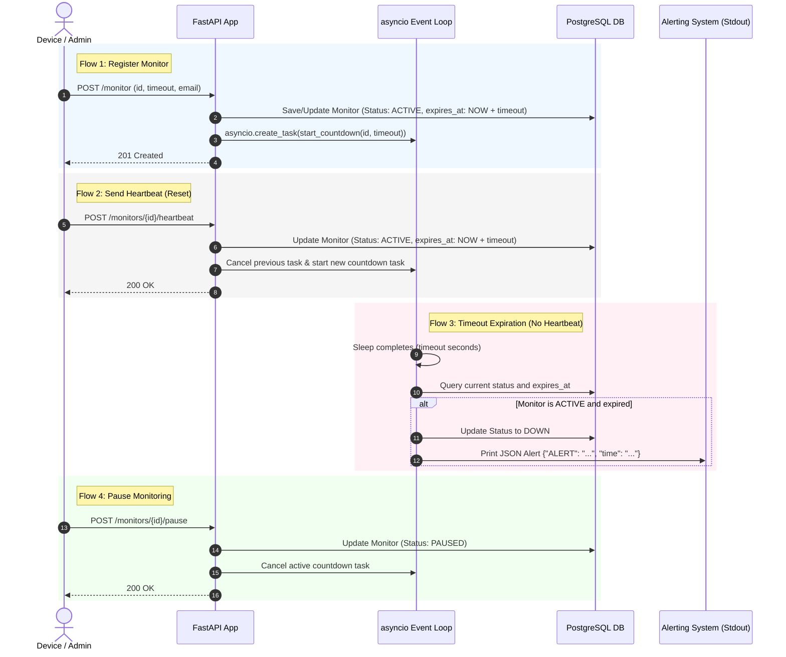

# Pulse-Check-API ("Watchdog" Sentinel)

Pulse-Check-API is a Dead Man's Switch backend service that tracks remote devices (e.g. solar farms, weather stations). If a device fails to report its heartbeat before its countdown timer reaches zero, the system automatically marks it as `down` and fires a critical alert.

---

## 1. Architecture Diagram

The system uses a persistent PostgreSQL database for monitor state and metadata, and Python's `asyncio` loop to run light-weight, stateful countdown timers in memory. Active timers are automatically rescheduled on application startup, guaranteeing resilience across server restarts.




---

## 2. Setup & Installation

### Prerequisites
- Python 3.10+
- PostgreSQL database running locally

### Installation Steps

1. **Clone/Download the repository** and navigate to the project directory:
   ```bash
   cd Pulse-Check-API
   ```

2. **Activate the Virtual Environment**:
   * Windows (CMD/PowerShell):
     ```powershell
     source env/Scripts/activate
     ```
   * macOS/Linux:
     ```bash
     source env/bin/activate
     ```

3. **Install Dependencies** (if not already cached in `env`):
   ```bash
   pip install fastapi uvicorn sqlalchemy psycopg2 pydantic
   ```

4. **Database Configuration**:
   Create a database named `pulse-api` in your local PostgreSQL. Update the connection string in `app/database.py` if necessary:
   ```python
   SQLALCHEMY_DATABASE_URL = "postgresql://postgres:<password>@localhost/pulse-api"
   ```

5. **Start the Application**:
   ```bash
   fastapi dev app/main.py
   ```
   The application will automatically initialize the database schema on startup and bind to `http://127.0.0.1:8000`.

---

## 3. API Documentation

### 1. Register a Monitor
Create or update a monitor timer for a device.
- **Endpoint**: `POST /monitor`
- **Content-Type**: `application/json`
- **Request Body**:
  ```json
  {
    "id": "device-123",
    "timeout": 60,
    "alert_email": "admin@critmon.com"
  }
  ```
- **Response**: `201 Created`

### 2. Heartbeat (Reset Countdown)
Restart the countdown timer for an active or paused monitor.
- **Endpoint**: `POST /monitors/{id}/heartbeat`
- **Response**: `200 OK` (or `404 Not Found` if the device is unregistered)

### 3. Pause Monitor (Snooze)
Pause the monitoring timer completely. Heartbeats will not be expected and no alerts will fire. Sending a heartbeat later will un-pause it.
- **Endpoint**: `POST /monitors/{id}/pause`
- **Response**: `200 OK` (or `404 Not Found` if the device is unregistered)

### 4. Get All Monitors (Developer's Choice)
List all registered monitors, their current status (`active`, `down`, `paused`), and configuration.
- **Endpoint**: `GET /monitors`
- **Response**: `200 OK`
  ```json
  {
    "Monitors": [
      {
        "id": "device-123",
        "timeout": 60,
        "alert_email": "admin@critmon.com",
        "status": "active",
        "expires_at": "2026-06-17T10:00:00Z"
      }
    ]
  }
  ```

### 5. Interactive API Documentation (Auto Docs)
When the application is running, you can access the automatically generated interactive API documentation to view schemas and test the endpoints directly from your browser:
- **Swagger UI**: [http://127.0.0.1:8000/docs](http://127.0.0.1:8000/docs)
- **ReDoc**: [http://127.0.0.1:8000/redoc](http://127.0.0.1:8000/redoc)

---

## 4. The Developer's Choice

### Active Timer Persistence & Restart Recovery
- **The Problem**: A common flaw in stateful in-memory architectures is server restarts. If the server crashes or reloads, all running memory countdowns (like `asyncio.sleep` tasks) are lost, resulting in monitors never firing their alerts.
- **The Solution**: On application startup (via the `@app.on_event("startup")` hook), our system queries the database for all `active` monitors, calculates their remaining countdown duration (`expires_at - current_time`), and reschedules the `asyncio` timers dynamically. If a monitor expired while the server was offline, the alert fires immediately on boot.
