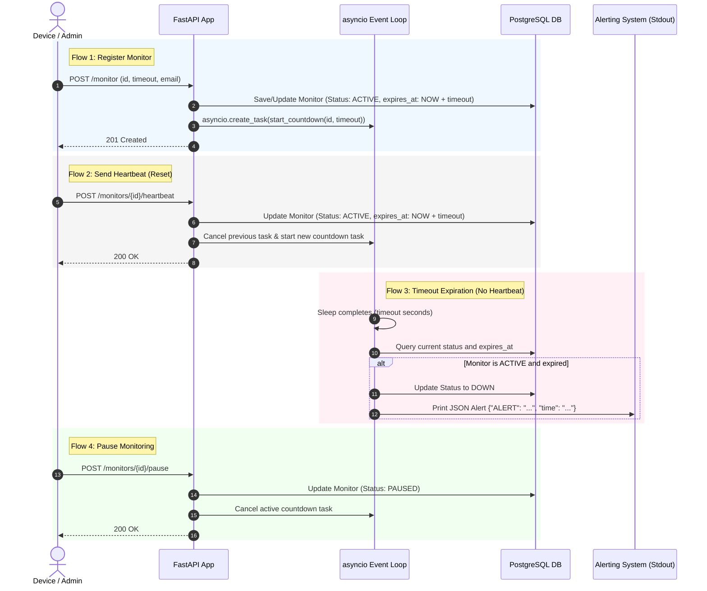

# Pulse-Check-API Architecture Diagram

This sequence diagram illustrates the lifecycle of a Monitor from registration, heartbeats, pausing, and timeout expiration.

```mermaid
sequenceDiagram
    autonumber
    actor Client as Device / Admin
    participant API as FastAPI App
    participant EventLoop as asyncio Event Loop
    participant DB as PostgreSQL DB
    participant Alert as Alerting System (Stdout)

    rect rgb(240, 248, 255)
        note right of Client: Flow 1: Register Monitor
        Client->>API: POST /monitor (id, timeout, email)
        API->>DB: Save/Update Monitor (Status: ACTIVE, expires_at: NOW + timeout)
        API->>EventLoop: asyncio.create_task(start_countdown(id, timeout))
        API-->>Client: 201 Created
    end

    rect rgb(245, 245, 245)
        note right of Client: Flow 2: Send Heartbeat (Reset)
        Client->>API: POST /monitors/{id}/heartbeat
        API->>DB: Update Monitor (Status: ACTIVE, expires_at: NOW + timeout)
        API->>EventLoop: Cancel previous task & start new countdown task
        API-->>Client: 200 OK
    end

    rect rgb(255, 240, 245)
        note right of EventLoop: Flow 3: Timeout Expiration (No Heartbeat)
        EventLoop->>EventLoop: Sleep completes (timeout seconds)
        EventLoop->>DB: Query current status and expires_at
        alt Monitor is ACTIVE and expired
            EventLoop->>DB: Update Status to DOWN
            EventLoop->>Alert: Print JSON Alert {"ALERT": "...", "time": "..."}
        end
    end

    rect rgb(240, 255, 240)
        note right of Client: Flow 4: Pause Monitoring
        Client->>API: POST /monitors/{id}/pause
        API->>DB: Update Monitor (Status: PAUSED)
        API->>EventLoop: Cancel active countdown task
        API-->>Client: 200 OK
    end
```
